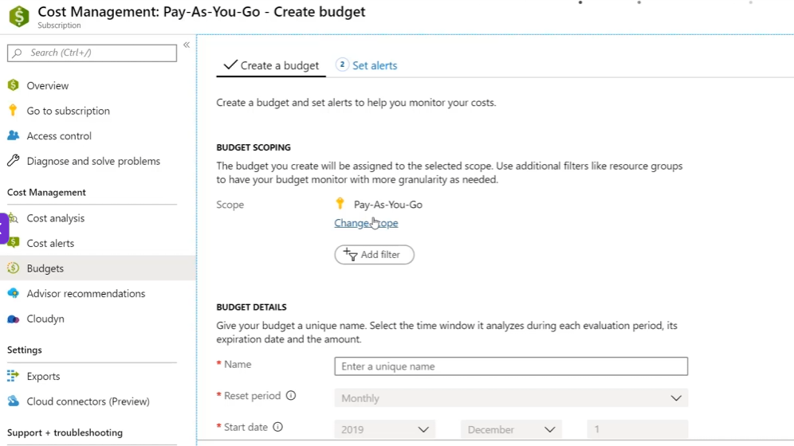

## Azure Budget 정리

2026.08.26

### 개념
Azure Budget은 Cost Management의 기능 중 하나로, 특정 스코프에서 지출 금액이나 사용량 임계치를 설정한 후 임계치를 넘으면 알림이 가는 서비스다. Action Group을 연결하면 자동 대응이 가능하다.

#### 설정 사항
1. Create a budget
    - 다른 scope 선택 가능
    - Budget Details
        - Name, Reset period, Start and Expiration date
    - Budget Amount: 기본적으로 'VIEW ON MONTHLY COST DATA'를 기반으로 자동 Amount를 추천한다.
2. Set Alert
    - Alert Conditions
        - % Of budget, Amount, Action group, Action group type
    - Alert recipents(email)

% Of budget을 이용해서 Budget Amount의 n%가 되었을 때 이메일 알림이 가게 하면 예산 너머의 지출을 막을 수 있다.